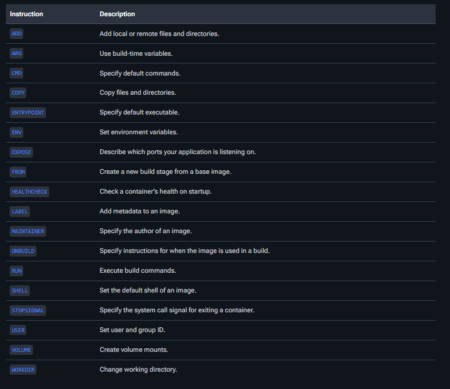
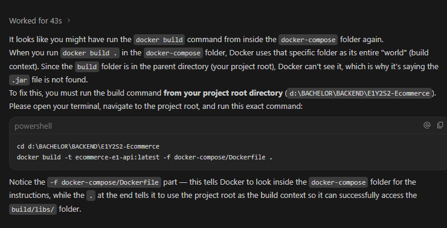
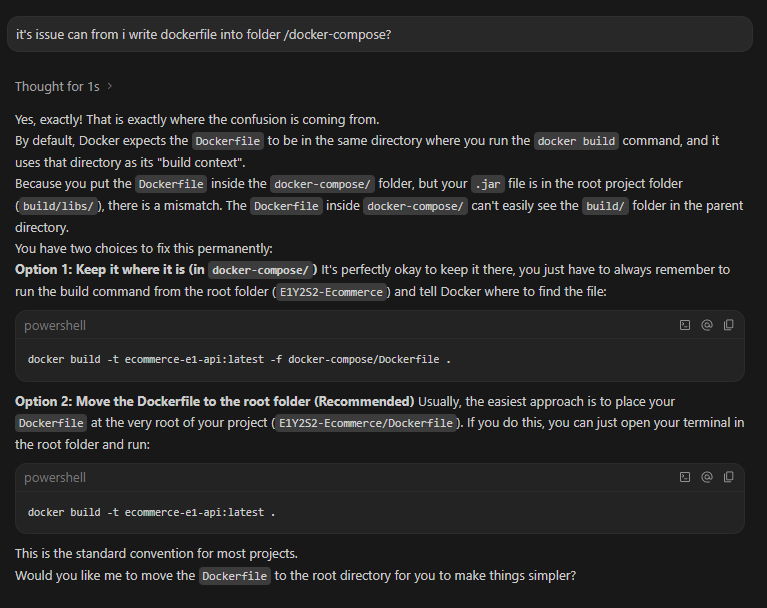

# Docker Information


# Configuration
## 1. application (Not secure)

## 2. Environment Variable (Secure)

---

## logs error: 
```aiignore
Building 0.5s (7/7) FINISHED                                                                                                                                                                 docker:desktop-linux
 => [internal] load build definition from Dockerfile                                                                                                                                                             0.0s
 => => transferring dockerfile: 352B                                                                                                                                                                             0.0s
 => [internal] load metadata for ghcr.io/graalvm/graalvm-community:25                                                                                                                                            0.4s
 => [internal] load .dockerignore                                                                                                                                                                                0.0s
 => => transferring context: 2B                                                                                                                                                                                  0.0s
 => CANCELED [1/3] FROM ghcr.io/graalvm/graalvm-community:25@sha256:7eeb80438dcda5edfcc58e804ce919018d2bf40ef61ddbb555936a8ba2a216aa                                                                             0.1s
 => => resolve ghcr.io/graalvm/graalvm-community:25@sha256:7eeb80438dcda5edfcc58e804ce919018d2bf40ef61ddbb555936a8ba2a216aa                                                                                      0.0s
 => [internal] load build context                                                                                                                                                                                0.0s
 => => transferring context: 2B                                                                                                                                                                                  0.0s
 => CACHED [2/3] WORKDIR /workspace                                                                                                                                                                              0.0s
 => ERROR [3/3] COPY build/libs/a01-e1-ecommerce-api-1.0.0.jar /workspace/api.jar                                                                                                                                0.0s
------
 > [3/3] COPY build/libs/a01-e1-ecommerce-api-1.0.0.jar /workspace/api.jar:
------
Dockerfile:9
--------------------
   7 |     
   8 |     WORKDIR /workspace
   9 | >>> COPY build/libs/a01-e1-ecommerce-api-1.0.0.jar /workspace/api.jar
  10 |     EXPOSE 8080
  11 |     
--------------------
ERROR: failed to build: failed to solve: failed to compute cache key: failed to calculate checksum of ref oqrv3h8xj2zlskxih2xa9097e::lehrayh833uu3f8coz5i7pumr: "/build/libs/a01-e1-ecommerce-api-1.0.0.jar": not found

View build details: docker-desktop://dashboard/build/desktop-linux/desktop-linux/pmsih9a7quqyvmtik3u95ffi8

What's next:
    Debug this build failure with Gordon → docker ai "help me fix this build failure"
```


## Solution:



